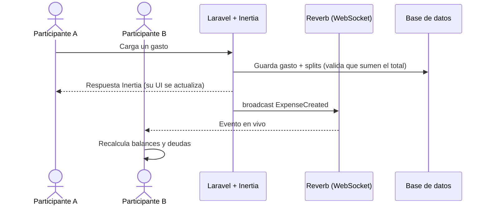
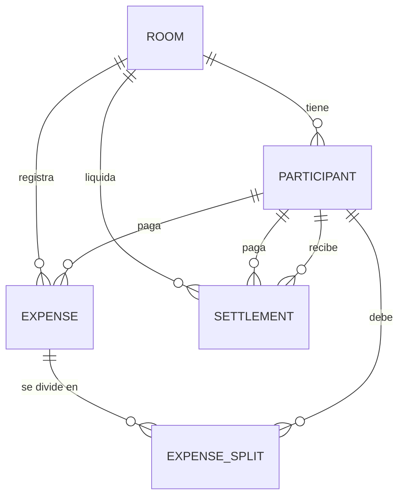

# 💸 Cuánto Dolió

App web para **dividir gastos grupales** — viajes, juntadas, asados, gastos del depto — y saber al instante **quién le debe a quién**, sin bajar nada y **sin crear cuenta**.

Cada gasto se reparte entre quienes participan, y la app calcula la forma más simple de saldar las deudas (la menor cantidad de transferencias). Todo se actualiza **en tiempo real**: si alguien carga un gasto, el resto lo ve al toque.

> 🔗 **Demo en vivo:** [cuantodolio.com](https://cuantodolio.com) · 📱 Instalable como PWA.

<!-- Demo GIF: cuando tengas uno lindo (ideal desde el cel, dos dispositivos en vivo), guardalo en docs/demo.gif y descomentá:   -->

---

## ✨ Qué hace

- **Salas sin login.** Creás una sala, compartís el link y cada uno entra con su nombre. La identidad vive en el dispositivo (sin usuario ni contraseña).
- **Gastos con categoría.** Quién pagó, cuánto, descripción y categoría (🍔 comida, 🍺 bebidas, 🛒 super, 🚕 transporte, 🏠 alojamiento, y más).
- **División flexible.** Elegís **entre quiénes** se divide cada gasto; se reparte en partes iguales con **distribución exacta de centavos** (10 entre 3 → 3,34 · 3,33 · 3,33, sin centavos perdidos).
- **Liquidación inteligente.** Un algoritmo simplifica las deudas para minimizar la cantidad de pagos, y podés marcarlas como pagadas.
- **Tiempo real.** Gastos, participantes y pagos se sincronizan en vivo entre todos los dispositivos (WebSockets).
- **Participantes "virtuales".** Podés sumar a alguien que no tiene el celu a mano y cargar gastos en su nombre.
- **Extras:** alias de pago por participante, exportar la sala a **PDF**, bloqueo de sala, "Mis salas", compartir por WhatsApp, y **PWA** instalable.

---

## 🛠️ Stack

| Capa | Tecnologías |
|---|---|
| **Backend** | PHP 8.2, **Laravel 12**, Eloquent |
| **Frontend** | **Inertia.js v2** + **Vue 3** + **TypeScript**, Tailwind CSS |
| **Tiempo real** | **Laravel Reverb** (servidor WebSocket) + Laravel Echo |
| **Otros** | Redis (opcional), DomPDF (export), Wayfinder (rutas tipadas), Vite, PWA |
| **Calidad** | Pest (tests), Pint + ESLint + Prettier, GitHub Actions (CI) |

Es un **monolito con SPA embebida** (Inertia): un solo proyecto sirve el backend y el front, sin una API REST separada.

---

## 🌟 Destacados técnicos

**Identidad sin login.** Cada participante se identifica con un `session_token` (guardado en el dispositivo) y un **UUID** no adivinable. El modelo `Participant` implementa `Authenticatable`, así que el participante *es* la identidad autenticada — resolviendo el acceso sin fricción sin resignar seguridad en los links de sala.

**Colaboración en tiempo real.** Cada acción relevante emite un evento que se transmite por WebSocket (`ExpenseCreated`, `ParticipantJoined`, `SettlementPaid`, `RoomLocked`…). El backend es la autoridad (persiste y valida); el front reacciona al instante.

**Simplificación de deudas (algoritmo greedy).** El corazón de la app:
1. Se calcula el **neto** de cada persona (lo que pagó − lo que le tocaba).
2. Se separan **acreedores** (a favor) y **deudores** (en contra).
3. Se matchea al mayor deudor con el mayor acreedor y se salda el menor de los dos.
4. Se repite hasta que todos quedan en cero.

El resultado es la **menor cantidad de transferencias** para que el grupo quede a mano.

---

## 🏗️ Arquitectura — flujo en tiempo real



## 🗂️ Modelo de dominio



- Una **sala** (`ROOM`) agrupa participantes, gastos y liquidaciones.
- Un **gasto** (`EXPENSE`) lo paga un participante y se reparte en **splits** (cuánto le toca a cada uno).
- Una **liquidación** (`SETTLEMENT`) registra un pago de un participante a otro para saldar deudas.

---

## 🚀 Correr en local

**Requisitos:** PHP 8.2+ (con `pdo_pgsql`), Composer, Node 20+, Docker.

```bash
# 1. Postgres + Redis (contenedores del docker-compose)
docker compose up -d

# 2. Dependencias y entorno (.env ya apunta a la base del compose)
composer install
cp .env.example .env
php artisan key:generate

# 3. Migraciones y front
php artisan migrate
npm install

# 4. Levantar todo junto: servidor + colas + Vite + Reverb
composer dev
```

La app queda en `http://localhost:8000`.

> **Tiempo real:** corre sobre **Laravel Reverb**. Por defecto el broadcasting va a `log`, así que la app funciona pero **sin** sincronización en vivo. Para activarla hay que configurar Reverb (`BROADCAST_CONNECTION=reverb` + claves `REVERB_*`).

---

## 🧪 Tests

Suite con **Pest**, corriendo en CI (GitHub Actions). Corren sobre una base Postgres de test (`cuantodolio_test`) que el `docker-compose` crea sola, así que necesitás los contenedores levantados (`docker compose up -d`).

```bash
composer test
```

Cubre el núcleo de la app — el **cálculo de balances y la simplificación de deudas** (`DebtSimplificationService`): balance neto por persona, liquidación a un solo pago, grupo "a mano", minimización de transferencias y el reparto exacto de centavos.

---

## 📌 Notas

- **Sin secretos en el repo:** toda la config sensible va por variables de entorno (ver `.env.example`).
- **CI:** GitHub Actions corre lint y tests en cada push.
- Las salas viejas se limpian solas con un comando programado (`CleanupExpiredRooms`).
